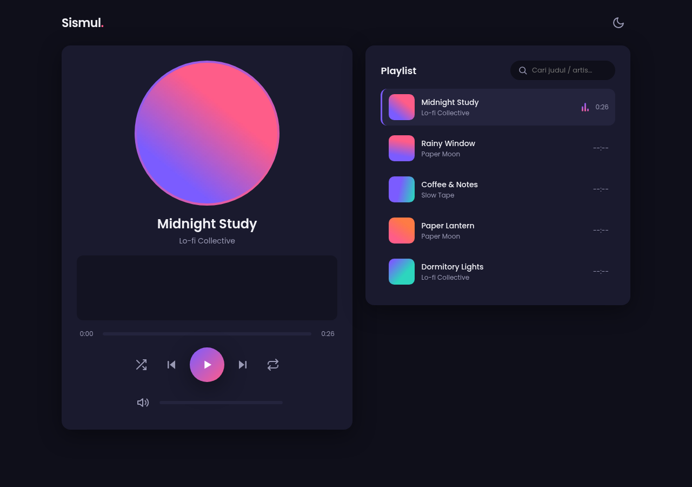

# Sismul — Study Lo-fi Player

Web Music Player dengan visualizer untuk tugas kuliah Multimedia. Vanilla HTML/CSS/JS, tanpa framework, tanpa bundler.

## Cara Menjalankan

```bash
python -m http.server 8000
# buka http://localhost:8000
```

Wajib lewat server lokal (bukan `file://`) agar Web Audio API tidak diblokir CORS. Audio mulai setelah klik pertama (autoplay policy).

## Fitur

- Play/pause, next/previous, progress bar + seek + waktu
- Volume slider + mute (disimpan di localStorage)
- Info lagu: judul, artis, cover berputar seperti vinyl
- Playlist: klik untuk putar, highlight aktif + equalizer mini, durasi per lagu
- Auto-next saat lagu selesai
- Visualizer bar real-time (Web Audio API + Canvas), berhenti saat pause
- Shuffle, repeat off/all/one, dark/light mode (localStorage)
- Pencarian playlist, shortcut Spasi / panah kiri / kanan
- Responsif 360px–1920px, hormati `prefers-reduced-motion`

## Struktur

```
index.html, css/style.css
js/main.js (penghubung), player.js, playlist.js, visualizer.js, utils.js
data/playlist.js, assets/audio/, assets/images/
```

## Sumber & Lisensi Aset

Seluruh audio dan cover dibuat sendiri dengan skrip lokal, bebas dipakai untuk tugas ini (setara CC0, tanpa atribusi):

- `assets/audio/track1–5.mp3` — komposisi lo-fi sintesis (pad chord + kick/hat + crackle vinyl), dibuat via Python `wave` + `ffmpeg` (MP3 128kbps). Sekitar 25–28 detik per lagu.
- `assets/images/cover1–5.jpg` — gradasi abstrak 500×500, dibuat via filter `gradients` ffmpeg.
- Font Poppins via Google Fonts. Ikon SVG inline buatan sendiri.

Asumsi: durasi pendek disengaja agar repo ringan dan mudah dipresentasikan; ganti file di `assets/` + `data/playlist.js` untuk lagu penuh.

## Screenshot


